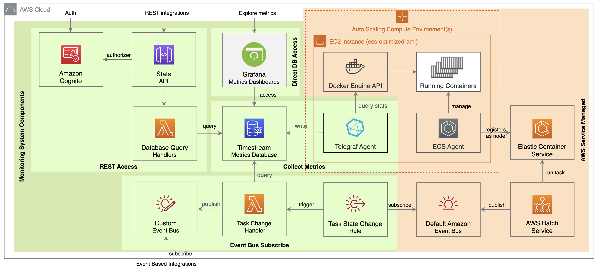
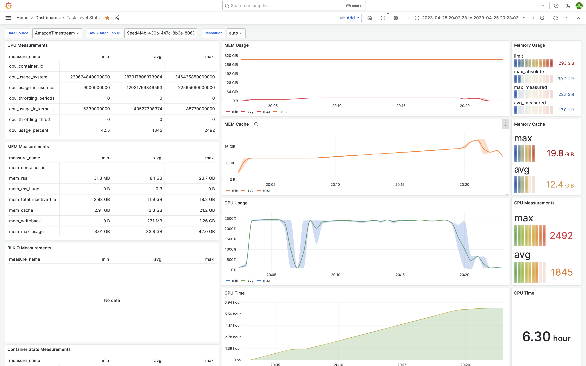
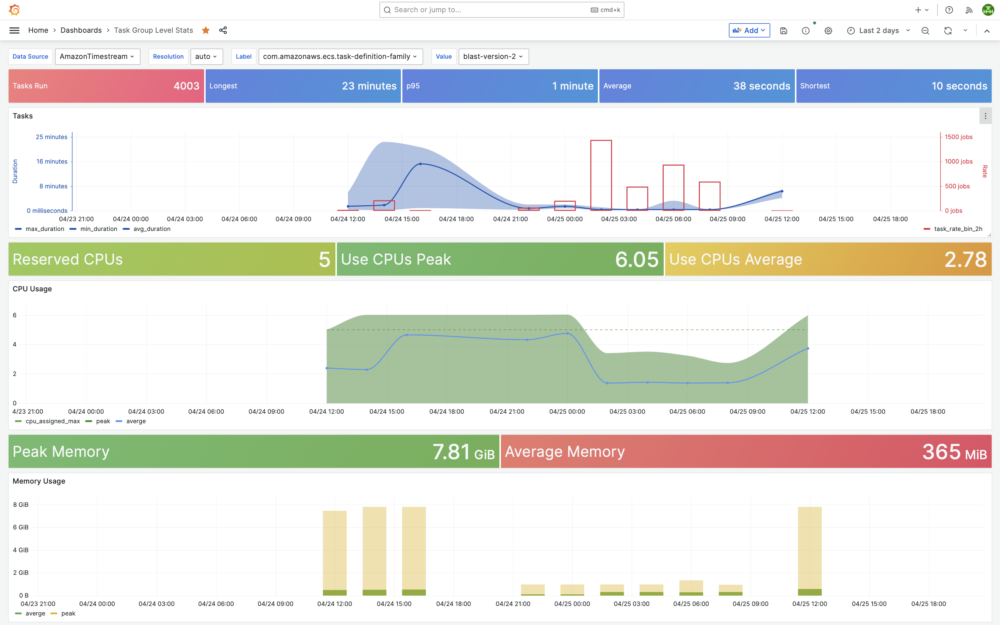

# CMK

This is a fine-grained metrics monitoring system optimized for bioinformatics workflow executions. It offers comprehensive insights into resource utilization for individual tasks and groups of tasks, with a focus on cost-effectiveness and integration with other systems.

## Table of Contents

- [CMK](#cmk)
  - [Table of Contents](#table-of-contents)
  - [Introduction](#introduction)
  - [Reference Architecture](#reference-architecture)
  - [Architecture on AWS](#architecture-on-aws)
    - [Collection](#collection)
    - [Storage](#storage)
    - [Access](#access)
    - [Dashboards](#dashboards)
    - [Features](#features)
  - [License](#license)
  - [Acknowledgements](#acknowledgements)

## Introduction

The increasingly common use of multiple Workflow Management Systems (WMS) platforms employing various workflow languages highlights the importance of efficient monitoring and resource usage optimization across these systems. An event-driven reference architecture for a multi-platform monitoring system is proposed that is designed to generate uniform aggregated metrics from tasks executed across different workflow systems. The proposed architecture accommodates task labeling and enables convenient grouping and aggregation of metrics. This approach builds upon existing technology, providing additional benefits in terms of modularity and the capacity to integrate with other data processing or collection systems. Although this proof of concept is implemented on Amazon Web Services (AWS), the same functional components can be adapted to other cloud providers or in-house platforms, highlighting the broad applicability and scalability of the system. This work holds substantial potential to enhance cost-effectiveness and resource usage efficiency in bioinformatics workflows.

## Reference Architecture

The architecture proposed here comprises a monitoring system to collect, store, and access metrics of a batch-processing environment. This monitoring system aims to offer insights into the use of resources at a granular level for every task executed in the system, as well as metrics for grouped tasks based on labels defined by the user, and create a summary of the use of resources based on these defined groups.

At the core of the system is the monitoring agent, which runs as a service on each cluster node. The agent is responsible for connecting to the Container Engine API at the instance level and for collecting metrics regarding the use of available resources by each container running on the same instance. The collected metrics are then saved into a Time Series Database (TSD) for future exploration. The TSD is a specialized database optimized for handling time-series data and has built-in functions and operators that allow for efficient data exploration. The database entries contain the values of the metrics, tagged with attributes such as the task, workflow id, or node instance ids. Additional labels can be attached to the tasks to create groupings from which aggregated statistics can be extracted. The database can then be queried directly, which allows for the inspection of the full range of collected metrics and the creation of resource usage dashboards.

Integrations with other systems are available through the use of a rest API, or by connecting to an event bus that provides real-time notifications of new metrics. When a task ends, the batch system notifies a task change event to a default event bus. A task change rule captures these events and invokes a handler function, which queries the database to create aggregated statistics and stores them in the TSD. The same handler can also publish the new aggregated metrics into an event bus.

## Architecture on AWS

Different  WMS used in bioinformatics, like Nextflow or Cromwell, support AWS Batch for the execution environment on AWS. This implementation collects metrics from tasks running in the AWS Batch service, configured with EC2 Compute Environments. AWS Batch is a task scheduling service comprised of queues and compute environments. A compute environment is a cluster of nodes that can scale automatically to match the resources required by the tasks in the queue.

### Collection

For the metrics collection, we use a Telegraf agent. Telegraf is a production-ready, open-source, plugin-based server agent for collecting, transforming, and reporting metrics. It is widely used in many applications, including monitoring databases, systems, or IoT sensors, and has a minimal memory footprint on the nodes. It supports collecting metrics from many systems configurable via plugins and has similar support for data output. In this case, we collect the data using the Docker Input plugin, which connects to the internal docker API of the host node via the docker.socks file to read the container statistics and collect the metrics we need from the containers. The Telegraf agent is deployed as a Daemon Service on the ECS cluster corresponding to the AWS Batch Compute Environment and runs parallel to the batch tasks.

### Storage

The Telegraf agent is configured with a Timestream output plugin to store the collected metrics data in Amazon Timestream, a fully managed serverless time series database service offered by AWS. The metrics are persisted in this database for a defined period, after which the data is automatically removed.

### Access

The metrics data can be directly retrieved from the Amazon Timestream service using the AWS console or from a third-party platform with Timestream integration. e.g., Grafana Cloud.
Aggregated statistics of the data are available via the REST API implemented in the API Gateway service or as events every time a task ends by subscribing with a rule to the custom event bus.
Amazon Cognito is used to access the REST API with authenticated users.

### Dashboards

A Grafana dashboard can directly visualize the resources used by a task, or by a group of tasks.

Metrics of One Task             |  Metrics Aggregated by Task Family
:-------------------------:|:-------------------------:
  |  

### Features

- Unified collection and visualization of metrics from different WMS
- Serverless, cost-effective implementation on AWS
- Monitoring tasks executed on AWS Batch, a popular backend platform for scientific WMS
- Grouping tasks by labels for aggregated statistics
- Modular structure and easy integration with other systems

## License

This project is licensed under the Apache License Version 2.0. See the [LICENSE](LICENSE) file for details.

 

## Acknowledgements

> Actuación cofinanciada por la Unión Europea a través del Programa Operativo del Fondo Europeo de Desarrollo Regional (FEDER) de la Comunitat Valenciana 2014-2020
